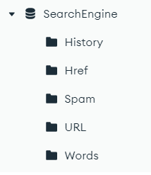
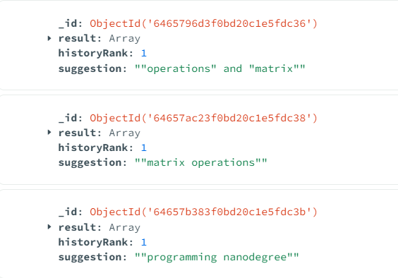
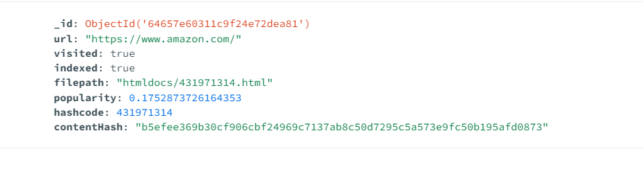
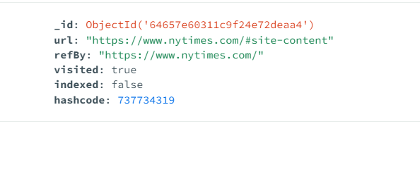
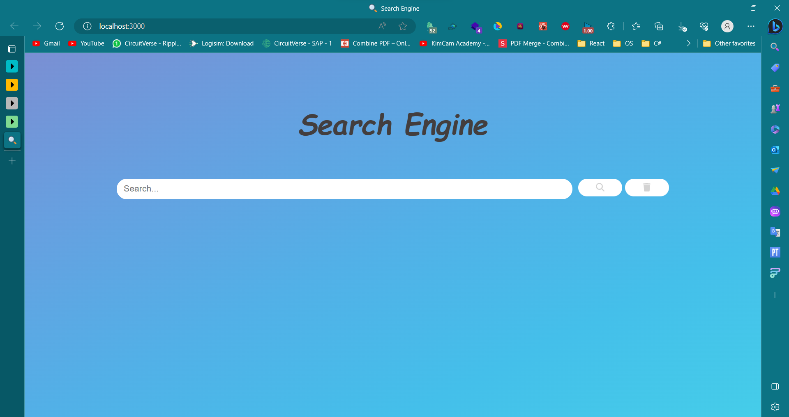
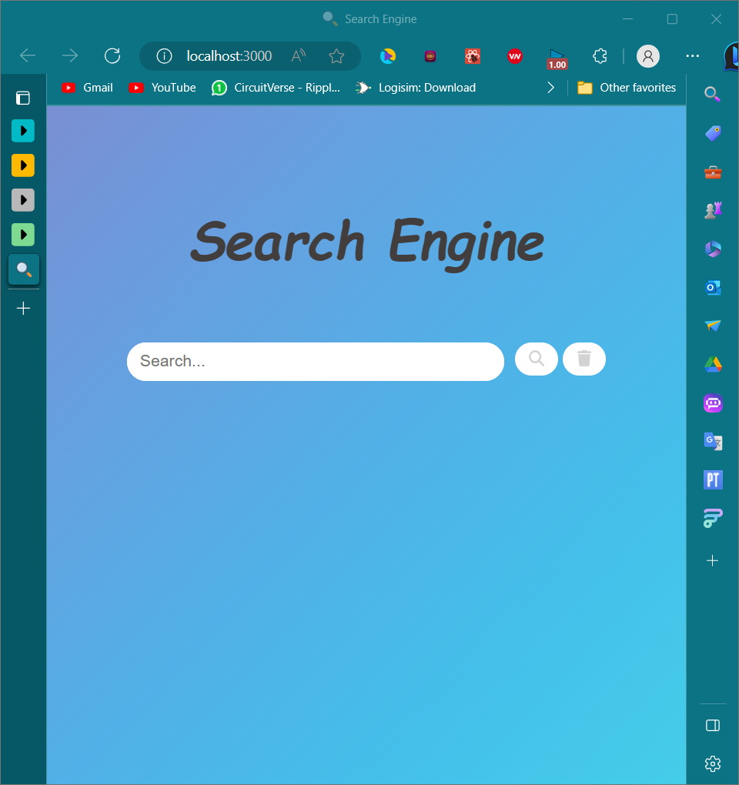
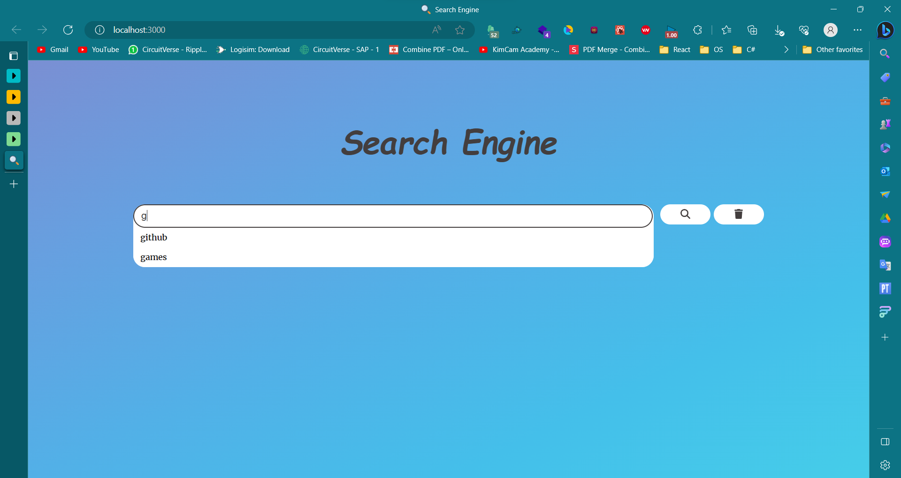
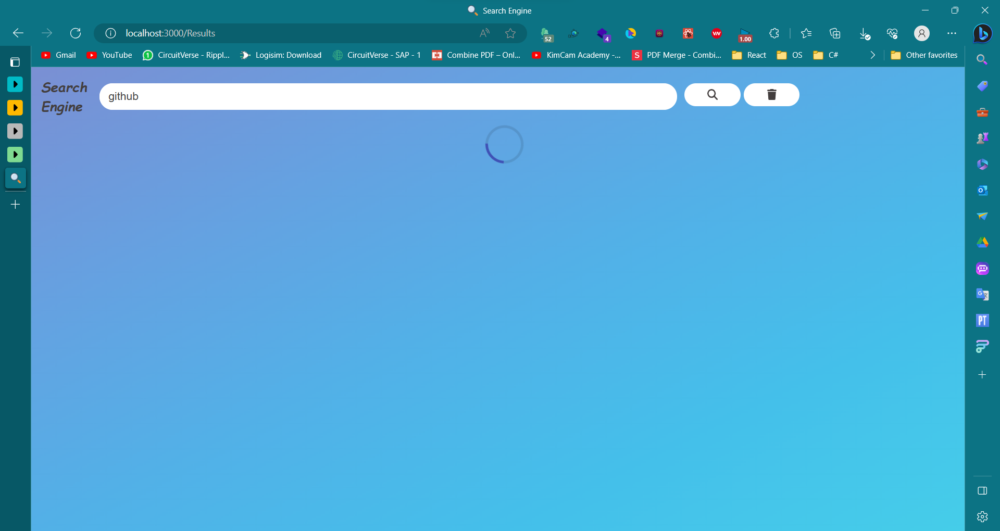
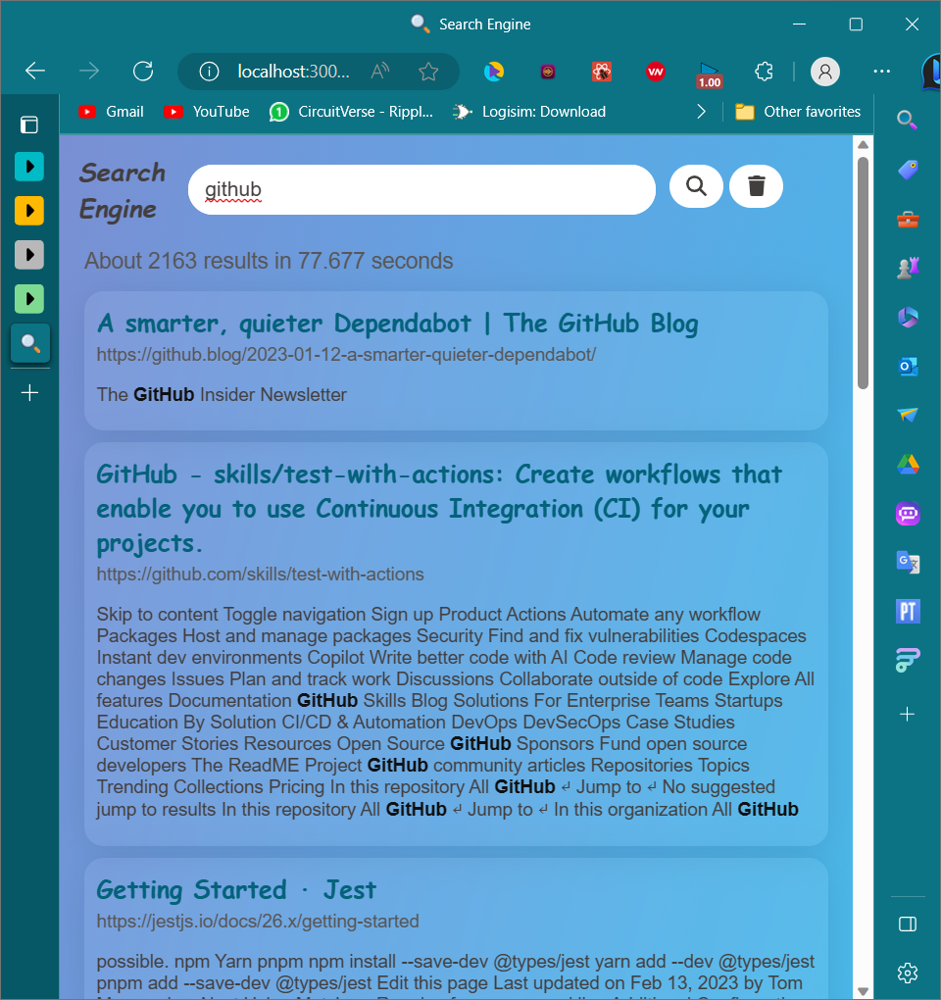

# YARM SEARCH ENGINE

## Project Modules

* Web Crawler
* Indexer
* Query Processor
* Ranker
* Phrase searching
* User Interface

### 1. Web Crawler 
The web crawler is responsible for collecting documents from the web. It starts with a list of URL addresses (seed set) and downloads the documents identified by these URLs. The crawler extracts hyperlinks from these documents and adds them to the list of URLs to be downloaded. It should adhere to certain guidelines and considerations, such as not visiting the same page more than once, normalizing URLs, and respecting exclusions specified in robots.txt. Additionally, it should support multithreading, where the number of threads can be controlled by the user.

### 2. Indexer
The indexer module processes the downloaded HTML documents and creates an index for fast retrieval. It stores the words contained in each document along with their importance (e.g., title, header, plain text) in a data structure. The index is persistent, stored in secondary storage (mongodb database). It also support incremental updates, allowing the addition of newly crawled documents to the existing index.

### 3. Query Processor
The query processor module receives search queries, performs necessary preprocessing, and searches the index for relevant documents. It retrieves documents containing words that share the same stem as those in the search query. For example, a search query for "travel" should match words like "traveler" or "traveling" with lower degrees of relevance.

### 4. Phrase searching
The search engine supports phrase searching, which involves searching for words as phrases when quotation marks are placed around them. Results obtained from phrase searching with quotation marks should only include webpages that have the same order of words as the search query.

### 5. Ranker
The ranker module is responsible for sorting documents based on their popularity and relevance to the search query.

## DataBase Design

## structure
### History collection

### URL collection

### HREF collection

### Word Collection

#### The project support up to 6k url documents, 260k words documents and 270k href documents

# USER INTERFACE

### The app support suggestions

